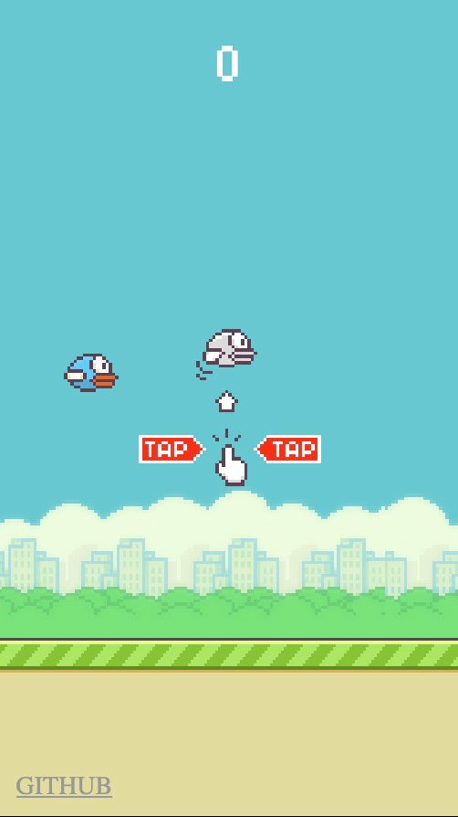
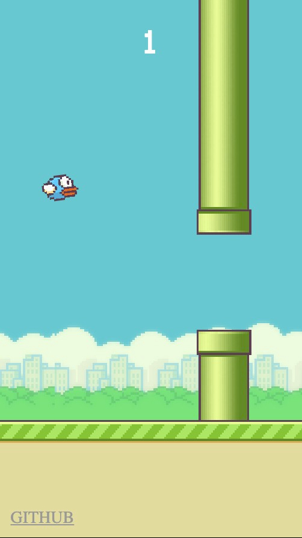
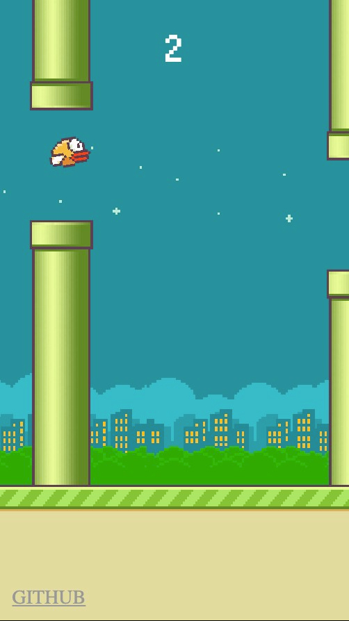

# Клон FlappyBird на TypeScript

### Для визулизации использовался Canvas

## Сборка
```bash
> git clone https://github.com/vicimpa/scrappy-bird2
> cd scrappy-bird2
> npm install
> npm run build-prod
```

## Запуск 
1. Открыть index.html
1. Или перейти [сюда](https://vicimpa.github.io/scrappy-bird2)


## Скриншоты

>
> 
>
> 
>
> 
>
> 
>
